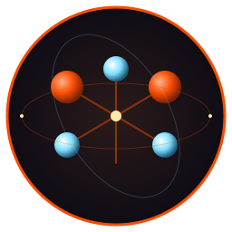

# Fe₂O₃ — Rust Terminal Suite



   

A suite of fast, opinionated terminal tools written in Rust. Single static binaries. Shared TUI foundation (crust). No runtime dependencies.

**Landing page:** [isene.github.io/fe2o3](https://isene.github.io/fe2o3/)

<br clear="left"/>

## The tools

### Binaries

| Tool | Release | Role | Ruby equivalent |
|---|---|---|---|
| [rush](https://github.com/isene/rush) |  | Interactive shell | [rsh](https://github.com/isene/rsh) |
| [pointer](https://github.com/isene/pointer) |  | File manager | [RTFM](https://github.com/isene/RTFM) |
| [kastrup](https://github.com/isene/kastrup) |  | Messaging hub (email, RSS, chat) | [Heathrow](https://github.com/isene/heathrow) |
| [scribe](https://github.com/isene/scribe) |  | Modal text editor for writers | — |
| [scroll](https://github.com/isene/scroll) |  | Web browser | [brrowser](https://github.com/isene/brrowser) |
| [tock](https://github.com/isene/tock) |  | Calendar with ephemeris | [Timely](https://github.com/isene/timely) |
| [astro](https://github.com/isene/astro) |  | Astronomy panel + telescope/eyepiece catalog | [astropanel](https://github.com/isene/astropanel) + [telescope-term](https://github.com/isene/telescope) |
| [watchit](https://github.com/isene/watchit) |  | Movie / series browser | [IMDB-terminal](https://github.com/isene/IMDB) |

> [nova](https://github.com/isene/nova) and [scope](https://github.com/isene/scope) have been merged into **astro** and are archived. [hyper](https://github.com/isene/hyper) has been folded into **scribe** — `.hl` editing now lives there with full hyperlist.vim parity. All three READMEs link to their replacements.

### Libraries

| Crate | Release | Role | Ruby equivalent |
|---|---|---|---|
| [crust](https://github.com/isene/crust) |  | TUI foundation (panes, colors, input) | [rcurses](https://github.com/isene/rcurses) |
| [glow](https://github.com/isene/glow) |  | Inline images (kitty / sixel / w3m / braille) | [termpix](https://github.com/isene/termpix) |
| [highlight](https://github.com/isene/highlight) |  | Theme-aware syntax highlighter (~18 source langs + HL / Markdown / LaTeX / email) | — |
| [orbit](https://github.com/isene/orbit) |  | Moon phases, ephemeris, sun / planet positions | [ephemeris](https://github.com/isene/ephemeris) |

## Install everything

```bash
# Linux x86_64 — one-liner to grab every Fe₂O₃ binary
for app in rush pointer kastrup scribe scroll tock astro watchit; do
  curl -L "https://github.com/isene/$app/releases/latest/download/$app-linux-x86_64" \
    -o ~/bin/$app && chmod +x ~/bin/$app
done

# Other platforms: replace -linux-x86_64 with:
#   -linux-aarch64   (Raspberry Pi, ARM64 Linux)
#   -macos-x86_64    (Intel Mac)
#   -macos-aarch64   (Apple Silicon)
```

## Why "Fe₂O₃"?

Rust the language took its name from rust the chemical. Fe₂O₃ is the iron oxide that gives rust its color, and what happens when iron meets oxygen meets time. This is the terminal-facing half of that toolkit.

Every tool is a feature port of a long-running Ruby original, rewritten for speed, single-binary distribution, and async-first UI behavior.

## License

All tools in the suite are public domain (Unlicense). Borrow or steal whatever you want.

— [Geir Isene](https://isene.com)
