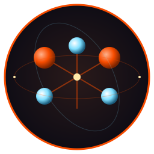
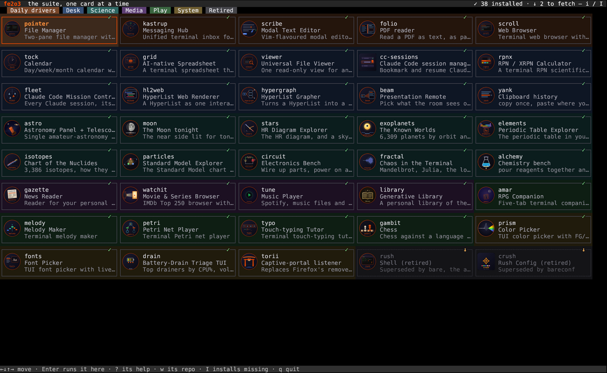

# Fe₂O₃ — Rust Terminal Suite



   

A suite of fast, opinionated terminal tools written in Rust. Single static binaries. Shared TUI foundation (crust). No runtime dependencies.

**Landing page:** [isene.github.io/fe2o3](https://isene.github.io/fe2o3/)

<br clear="left"/>

## The launcher

This repo also holds `fe2o3` itself: the suite as a grid of cards, one per
app, with its logo, what it is and one line on why. Arrow keys move, Enter
runs it **in the same terminal**, `?` shows that app's own help, `w` opens
its repo, `/` filters.

It is also the installer. What you have has a solid frame and a green
`✓`; what you do not have is dashed with an amber `↓`. `i` fetches the one
under the cursor, `I` fetches every missing one in view — so you can take
the launcher alone and pick up only the apps you fancy. Binaries land in
`~/bin` if you have it, else `~/.local/bin`. A `~/bin/<tool>` that is a
symlink to a local build is left alone.



```bash
cargo build --release        # or grab the binary from Releases
fe2o3                        # the grid
fe2o3 -l                     # the suite as plain text
```

Adding an app to the suite is one command:

```bash
tools/add-app isotopes --kind "Chart of the Nuclides" --group Science \
  --blurb "3,386 isotopes, how they decay and what into" \
  --desc "Neutrons across, protons up, coloured by how each one comes apart."
```

That writes the launcher row, renders the card logo from the app's own
SVG, adds the table rows here and in `CLAUDE.md`, puts a card on the
landing page in the right group with the count bumped, and drops a
release workflow into the app's repo if it has none. `--check` shows
what it would do; running it twice changes nothing the second time.

## The tools

### Binaries

| Tool | Release | Role | Ruby equivalent |
|---|---|---|---|
| [pointer](https://github.com/isene/pointer) |  | File manager | [RTFM](https://github.com/isene/RTFM) |
| [kastrup](https://github.com/isene/kastrup) |  | Messaging hub (email, RSS, chat) | [Heathrow](https://github.com/isene/heathrow) |
| [scribe](https://github.com/isene/scribe) |  | Modal text editor for writers | — |
| [scroll](https://github.com/isene/scroll) |  | Web browser | [brrowser](https://github.com/isene/brrowser) |
| [gazette](https://github.com/isene/gazette) |  | Daily news digest reader | — |
| [tock](https://github.com/isene/tock) |  | Calendar with ephemeris | [Timely](https://github.com/isene/timely) |
| [astro](https://github.com/isene/astro) |  | Astronomy panel + telescope/eyepiece catalog | [astropanel](https://github.com/isene/astropanel) + [telescope-term](https://github.com/isene/telescope) |
| [watchit](https://github.com/isene/watchit) |  | Movie / series browser | [IMDB-terminal](https://github.com/isene/IMDB) |
| [torii](https://github.com/isene/torii) |  | Captive-portal listener (NetworkManager → Firefox) | — |
| [prism](https://github.com/isene/prism) |  | TUI color picker (FG/BG slots, RGB+HSV, WCAG contrast) | — |
| [fonts](https://github.com/isene/fonts) |  | TUI font picker with live previews (enumerates installed fonts via glyph); returns family + size | — |
| [drain](https://github.com/isene/drain) |  | Battery-drain triage TUI (top wakers, per-WS attribution) | — |
| [amar](https://github.com/isene/amar) |  | Amar RPG companion (NPC / encounter / town / weather forge, campaign tracker, lore, AI inspire) | [Amar-Tools](https://github.com/isene/Amar-Tools) |
| [tune](https://github.com/isene/tune) |  | Spotify Connect controller (search, library, queue, devices, transport) | — |
| [melody](https://github.com/isene/melody) |  | Melody maker — piano-roll play / record / edit, metronome, WAV export | — |
| [petri](https://github.com/isene/petri) |  | Petri net player — load a net, fire transitions, watch conflicts, find deadlocks | — |
| [library](https://github.com/isene/library) |  | Generative personal library (curate a shelf of books that should exist, then have them written on demand) | — |
| [grid](https://github.com/isene/grid) |  | AI-native spreadsheet (csv/xlsx/ods, formula engine, Claude editing) | — |
| [viewer](https://github.com/isene/viewer) |  | Universal file viewer (tables, docs, slides, pdf, images, code; launches the right editor) | — |
| [CC-sessions](https://github.com/isene/CC-sessions) |  | Claude Code session manager (`cc`/`cl`: bookmark + resume sessions with tags, `/bm` command) | CC-sessions ≤1.5 (Ruby) |
| [rpnx](https://github.com/isene/rpnx) |  | RPN / XRPN scientific calculator (HP-41 stack, cycling shift pages, runs XRPN programs) | [T-REX](https://github.com/isene/T-REX) |
| [typo](https://github.com/isene/typo) |  | Touch-typing tutor (strict drills, live WPM/accuracy, US + Norwegian layouts) | — |
| [elements](https://github.com/isene/elements) |  | Periodic table explorer (118 elements + hypothesized 119–126, full Wikipedia article per element, offline) | — |
| [isotopes](https://github.com/isene/isotopes) |  | Chart of the nuclides (3,386 isotopes, decay modes, half-lives, decay chains) | — |
| [stars](https://github.com/isene/stars) |  | Hertzsprung-Russell diagram explorer (461 named stars, evolutionary tracks, full Wikipedia article per star, and a sky map to pick from) | — |
| [particles](https://github.com/isene/particles) |  | Standard Model explorer (17 fundamental particles + proton/neutron, and a rotatable zoom from atom to quark) | — |
| [exoplanets](https://github.com/isene/exoplanets) |  | The known exoplanets (6,309 worlds by orbit and size, systems, habitable zones) | — |
| [fractal](https://github.com/isene/fractal) |  | Chaos and fractals in braille (Mandelbrot, Julia, logistic map, Lorenz, Hénon) | — |

### Retired

Superseded by the assembly tools in [CHasm](https://github.com/isene/chasm), which do the same job with a fraction of the cycles.

| Tool | Release | Was | Replaced by |
|---|---|---|---|
| [rush](https://github.com/isene/rush) |  | Interactive shell | [bare](https://github.com/isene/bare) |
| [crush](https://github.com/isene/crush) |  | Configuration TUI for rush | [bareconf](https://github.com/isene/bareconf) |

> [nova](https://github.com/isene/nova) and [scope](https://github.com/isene/scope) have been merged into **astro** and are archived. [hyper](https://github.com/isene/hyper) has been folded into **scribe** — `.hl` editing now lives there with full hyperlist.vim parity. All three READMEs link to their replacements.

### Libraries

| Crate | Release | Role | Ruby equivalent |
|---|---|---|---|
| [crust](https://github.com/isene/crust) |  | TUI foundation (panes, colors, input) | [rcurses](https://github.com/isene/rcurses) |
| [glow](https://github.com/isene/glow) |  | Inline images (kitty / sixel / w3m / braille) | [termpix](https://github.com/isene/termpix) |
| [highlight](https://github.com/isene/highlight) |  | Theme-aware syntax highlighter (~18 source langs + HL / Markdown / LaTeX / email) | — |
| [orbit](https://github.com/isene/orbit) |  | Moon phases, ephemeris, sun / planet positions | [ephemeris](https://github.com/isene/ephemeris) |
| [starmap](https://github.com/isene/starmap) |  | The naked-eye sky in braille (9,096 stars with distances, constellation figures, star picker) | — |
| [plot](https://github.com/isene/plot) |  | Terminal charts (sparkline / line / candle / bar) with Unicode + ANSI | [termchart](https://github.com/isene/termchart) |
| [fe2o3-rpnx-core](https://github.com/isene/rpnx-core) |  | RPN / XRPN calculator engine shared by rpnx (TUI) + the RPNx phone app | — |
| [mail](https://github.com/isene/mail) |  | Email plumbing (MIME, HTML-to-text, read state across devices) shared by kastrup + the nomad mail app | — |

## Companion apps — [nomad](https://github.com/isene/nomad)

The mobile half of the family. **[nomad](https://github.com/isene/nomad)** is a
single Android monorepo — a shared **Rust core** (the same logic as the
desktop, via [UniFFI](https://mozilla.github.io/uniffi-rs/)) under thin
**Kotlin / Compose** shells. Each app carries one Fe₂O₃ workflow off the laptop
and syncs its data over [Syncthing](https://syncthing.net) — no Google account,
no cloud middleman.

| App | Pairs with | Role |
|---|---|---|
| **tasks** | [scribe](https://github.com/isene/scribe), [kastrup](https://github.com/isene/kastrup) | HyperList todo editor + Glance widget for `~/.tasks/todo.hl` |
| **hyperlist** | [scribe](https://github.com/isene/scribe) | General HyperList editor with full syntax highlighting |
| **relay** | [kastrup](https://github.com/isene/kastrup) | Notification gateway (WhatsApp / Messenger / IG / SMS / Discord → kastrup) — replaces the laptop Marionette bridge |
| **astro** | [astro](https://github.com/isene/astro) | Ephemeris, weather + observing conditions, events, APOD, gear catalog |
| **watchit** | [watchit](https://github.com/isene/watchit) | TMDB movie / series browser with wish/dump lists |
| **amardice** | [amar](https://github.com/isene/amar) | Amar RPG O6 dice roller (skill / combat / fear) |
| **rpnx** | [rpnx](https://github.com/isene/rpnx) | Pocket HP-41 RPN calculator + FOCAL program runner (same engine as the rpnx TUI) |
| **scribe** | [scribe](https://github.com/isene/scribe) | Distraction-free notes pad — touch companion to the scribe editor |
| **ref** | — | Offline, searchable reference reader (glossaries, books, personal writings) |
| **vox** | — | Voice quick-capture — pocket version of the laptop `Win+a` voice-to-text |
| **gazette** | [gazette](https://github.com/isene/gazette) | Daily news digest reader — browse the last 7 issues (and PDF) synced into `~/.news` |
| **books** | [library](https://github.com/isene/library) | The library on your phone, read-only: only the books you have made, grouped by shelf, with inline figures |
| **onepage** | — | Minimal Android home launcher (one screen, freely-placed widgets, zero idle cost) |
| **mail** | [kastrup](https://github.com/isene/kastrup) | Your Gmail inboxes on the phone — same decoder as kastrup, bodies on demand, an explicit Mark READ that reaches the laptop |

## Install everything

Get the launcher, then let it fetch the rest: press `I` in the grid and
every app you do not have is downloaded.

```bash
curl -L "https://github.com/isene/fe2o3/releases/latest/download/fe2o3-linux-x86_64" \
  -o ~/bin/fe2o3 && chmod +x ~/bin/fe2o3
fe2o3          # then press I

# Other platforms: replace -linux-x86_64 with:
#   -linux-aarch64   (Raspberry Pi, ARM64 Linux)
#   -macos-x86_64    (Intel Mac)
#   -macos-aarch64   (Apple Silicon)
```

Or grab them all straight from the shell:

```bash
for app in pointer kastrup scribe scroll gazette tock astro watchit torii prism fonts drain amar tune melody petri library grid viewer rpnx typo fractal elements isotopes exoplanets stars particles; do
  curl -L "https://github.com/isene/$app/releases/latest/download/$app-linux-x86_64" \
    -o ~/bin/$app && chmod +x ~/bin/$app
done
```

## Why "Fe₂O₃"?

Rust the language was actually named after a family of fungi (Pucciniales, plant pathogens "over-engineered for survival" per Graydon Hoare). The iron-oxide association came later, through the visual rhyme with what those fungi look like on a leaf. Fe₂O₃ is that iron oxide: what happens when iron meets oxygen meets time. This is the terminal-facing half of that toolkit.

Every tool is a feature port of a long-running Ruby original, rewritten for speed, single-binary distribution, and async-first UI behavior.

## License

All tools in the suite are public domain (Unlicense). Borrow or steal whatever you want.

— [Geir Isene](https://isene.com)
